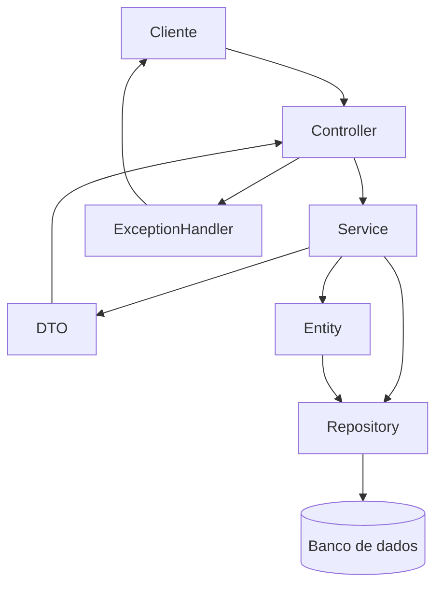
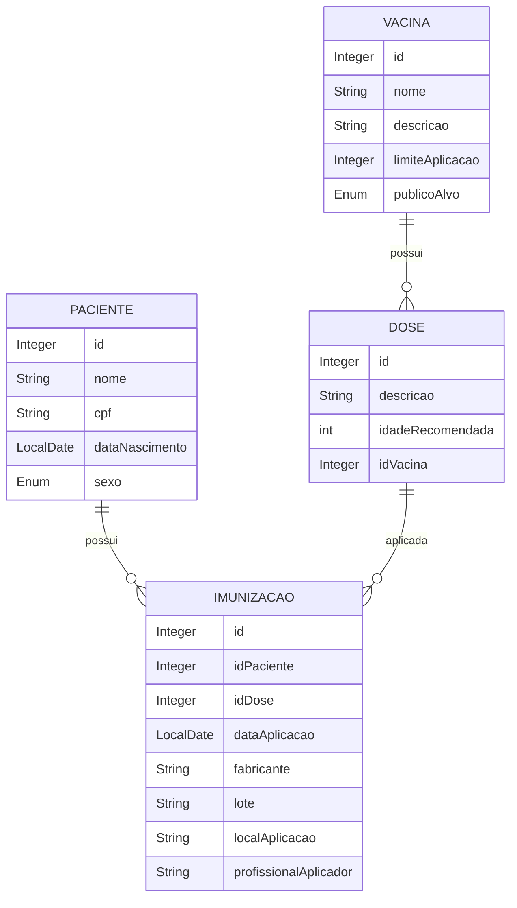
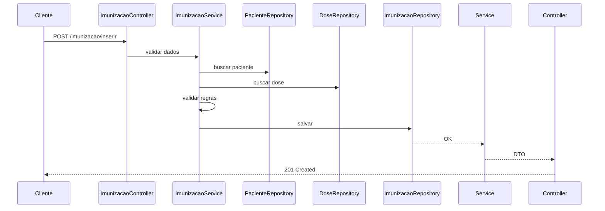

<div align="center">
 


# 💉 API de Calendário de Vacinação

**Sistema completo para gerenciamento do histórico de imunização familiar**  
com controle de doses, validações inteligentes e calendário vacinal automatizado.
 
<br/>
 


 


 
</div>
 
---

# 📖 Sobre o projeto

A **API de Calendário de Vacinação** é um sistema backend desenvolvido em **Java com Spring Boot** que permite o controle completo do histórico de vacinação de pacientes.

O sistema permite:

* Cadastro de pacientes
* Cadastro de vacinas
* Registro de imunizações
* Controle de doses aplicadas
* Consultas por período
* Identificação de vacinas atrasadas
* Estatísticas de vacinação

Projeto desenvolvido como parte do **Hackathon Mesttra**.

---

# 🎯 Objetivo do sistema

Fornecer uma API REST capaz de:

* Centralizar histórico vacinal
* Garantir integridade dos dados médicos
* Aplicar validações de regras de negócio
* Permitir futuras integrações frontend
* Gerar indicadores de vacinação

---

# 🏗️ Arquitetura do sistema

O projeto segue arquitetura em camadas:

Controller → Service → Repository → Entity → DTO → Exception Handler



---

# 🗄️ Modelo de dados



---

# 🔄 Fluxo de registro de imunização



---

## 🚀 Tecnologias Utilizadas
 
O projeto utiliza o ecossistema Spring para fornecer uma base robusta e escalável:
 
| Tecnologia | Versão | Descrição |
|---|---|---|
| ☕ **Java** | 17 (LTS) | Linguagem base do projeto |
| 🍃 **Spring Boot** | 4.0.3 | Framework principal |
| 🗄️ **Spring Data JPA** | — | Abstração da camada de persistência |
| 🐬 **MySQL** | — | Banco de dados relacional |
| 📖 **SpringDoc OpenAPI** | — | Documentação interativa (Swagger) |
| 📦 **Maven** | — | Gerenciador de dependências e build |
 
# 📋 Funcionalidades

## 👤 Pacientes

* Cadastrar paciente
* Consultar pacientes
* Consultar por ID
* Atualizar paciente
* Excluir paciente

Validações:

* CPF não pode duplicar
* Data nascimento não pode ser futura
* Nome não pode duplicar

---

## 💉 Vacinas

* Consulta geral
* Consulta por faixa etária
* Consulta por idade mínima

---

## 📋 Imunizações

* Registrar aplicação
* Atualizar registro
* Excluir registro
* Consultar por paciente
* Consultar por período

Validações:

* Data não pode ser futura
* Data não pode ser anterior ao nascimento
* Dose não pode duplicar

---

## 📊 Estatísticas

O sistema possui consultas para:

* Vacinas aplicadas por paciente
* Vacinas atrasadas
* Vacinas previstas
* Indicadores de vacinação

---

# 📡 Endpoints principais

## Paciente

```http
GET /paciente/consultar

GET /paciente/consultar/{id}

POST /paciente/inserir

PUT /paciente/alterar/{id}

DELETE /paciente/excluir/{id}
```

---

## Vacinas

```http
GET /vacinas/consultar

GET /vacinas/consultar/faixa_etaria/{faixa}

GET /vacinas/consultar/idade_maior/{meses}
```

---

## Imunização

```http
GET /imunizacao/consultar

GET /imunizacao/consultar/{id}

GET /imunizacao/consultar/paciente/{id}

GET /imunizacao/consultar/paciente/{id}/aplicacao/{dt_ini}/{dt_fim}

POST /imunizacao/inserir

PUT /imunizacao/alterar/{id}

DELETE /imunizacao/excluir/{id}

DELETE /imunizacao/excluir/paciente/{id}
```

## Estatísticas

```http
GET /estatisticas/imunizacoes/paciente/{id}

GET /estatisticas/proximas_imunizacoes/paciente/{id}

GET /estatisticas/imunizacoes_atrasadas/paciente/{id}

GET /estatisticas/imunizacoes/idade_maior/{id}

```

---

# 📬 Exemplo request

Cadastro paciente:

```json
{
"nome":"Maria Silva",
"cpf":"67108083434",
"sexo":"F",
"dataNascimento":"2000-05-10"
}
```

---

# 📤 Exemplo response

```json
{
"id":1,
"nome":"Maria Silva",
"cpf":"67108083434"
}
```

---

## 🛠️ Como Executar
 
### Pré-requisitos
 
- [x] **Java 17** instalado
- [x] Servidor **MySQL** rodando localmente
- [x] Variáveis de ambiente configuradas:
 
```bash
JDBC_USERNAME_LOCALHOST=seu_usuario
JDBC_PASSWORD_LOCALHOST=sua_senha
```
 
### Passo a passo
 
**1. Clone o repositório**
```bash
git clone https://github.com/seu-usuario/seu-repositorio.git
cd seu-repositorio
```
 
**2. Crie o banco de dados no MySQL**
```sql
DROP DATABASE IF EXISTS vacinacao;
CREATE DATABASE vacinacao;

USE vacinacao;

CREATE TABLE `vacina` (
  `id_vacina` int NOT NULL AUTO_INCREMENT,
  `nome_vacina` varchar(50) NOT NULL,
  `descricao_vacina` varchar(200) NOT NULL,
  `limite_aplicacao` int DEFAULT NULL,
  `publico_alvo` enum('CRIANÇA','ADOLESCENTE','ADULTO','GESTANTE') NOT NULL,
  PRIMARY KEY (`id_vacina`),
  UNIQUE KEY `vacina_UNIQUE` (`nome_vacina`)
) ENGINE=InnoDB AUTO_INCREMENT=17 DEFAULT CHARSET=utf8mb4;

CREATE TABLE `paciente` (
  `id_paciente` int NOT NULL AUTO_INCREMENT,
  `nome_paciente` varchar(60) NOT NULL,
  `cpf_paciente` varchar(11) DEFAULT NULL,
  `sexo` enum('M','F') NOT NULL,
  `data_nascimento` date NOT NULL,
  PRIMARY KEY (`id_paciente`),
  UNIQUE KEY `nome_UNIQUE` (`nome_paciente`)
) ENGINE=InnoDB AUTO_INCREMENT=1 DEFAULT CHARSET=utf8mb4;

CREATE TABLE `dose` (
  `id_dose` int NOT NULL AUTO_INCREMENT,
  `id_vacina` int NOT NULL,
  `descricao_dose` varchar(45) NOT NULL,
  `idade_recomendada_aplicacao` int NOT NULL,
  PRIMARY KEY (`id_dose`),
  UNIQUE KEY `unique_id_vacina_dose` (`id_vacina`,`id_dose`),
  KEY `fk_vacina_id_idx` (`id_vacina`),
  CONSTRAINT `fk_vacina_id` FOREIGN KEY (`id_vacina`) REFERENCES `vacina` (`id_vacina`)
) ENGINE=InnoDB AUTO_INCREMENT=30 DEFAULT CHARSET=utf8mb4;

CREATE TABLE `imunizacoes` (
  `id_imunizacao` int NOT NULL AUTO_INCREMENT,
  `id_paciente` int NOT NULL,
  `id_dose` int NOT NULL,
  `data_aplicacao` date NOT NULL,
  `fabricante` varchar(45) DEFAULT NULL,
  `lote` varchar(45) DEFAULT NULL,
  `local_aplicacao` varchar(45) DEFAULT NULL,
  `profissional_aplicador` varchar(45) DEFAULT NULL,
  PRIMARY KEY (`id_imunizacao`),
  UNIQUE KEY `unique_dose_paciente` (`id_paciente`,`id_dose`),
  KEY `fk_paciente_id_idx` (`id_paciente`),
  KEY `fk_dose_id_idx` (`id_dose`) ,
  CONSTRAINT `fk_dose_id` FOREIGN KEY (`id_dose`) REFERENCES `dose` (`id_dose`),
  CONSTRAINT `fk_paciente_id` FOREIGN KEY (`id_paciente`) REFERENCES `paciente` (`id_paciente`)
) ENGINE=InnoDB AUTO_INCREMENT=1 DEFAULT CHARSET=utf8mb4;


INSERT INTO vacina VALUES (1,'BCG','Proteção contra formas graves de tuberculose (meníngea e miliar)', 60,'CRIANÇA');
INSERT INTO vacina VALUES (2,'Hepatite B','Proteção contra o vírus da Hepatite B', NULL,'CRIANÇA');
INSERT INTO vacina VALUES (3,'Poliomielite 1, 2 e 3','Proteção contra o vírus da Poliomielite', NULL,'CRIANÇA');
INSERT INTO vacina VALUES (4,'Rotavírus','Proteção contra o rotavírus humano G1P[8] (ROTA)', 9, 'CRIANÇA');
INSERT INTO vacina VALUES (5,'Pentavalente (DTP, HB, Hib)','Proteção contra DTP (difteria, tétano, coqueluche), HB (hepatite b) e Hib (influenza tipo b)', 84 ,'CRIANÇA');
INSERT INTO vacina VALUES (6,'Pneumocócica 10','Proteção contra Pneumonias, Meningites, Otites e Sinusites pelos sorotipos que compõem a vacina', 60, 'CRIANÇA');
INSERT INTO vacina VALUES (7,'Meningocócica C','Proteção contra Meningite meningocócica tipo C',60,'CRIANÇA');
INSERT INTO vacina VALUES (8,'COdoseVID-19','Proteção contra o vírus SARS-CoV-2', 60 ,'CRIANÇA');
INSERT INTO vacina VALUES (9,'Febre Amarela','Proteção contra o vírus da febre amarela',NULL,'CRIANÇA');
INSERT INTO vacina VALUES (10,'Tríplice Viral','Proteção contra os vírus: sarampo, caxumba e rubéola', 72,'CRIANÇA');
INSERT INTO vacina VALUES (11,'Tetraviral','Proteção contra os vírus: sarampo, caxumba, rubéola e varicela', 84,'CRIANÇA');
INSERT INTO vacina VALUES (12,'Hepatite A','Proteção contra o vírus da Hepatite A', 60,'CRIANÇA');
INSERT INTO vacina VALUES (13,'DTP ','Proteção contra Difteria, Tétano e Pertussis', 84,'CRIANÇA');
INSERT INTO vacina VALUES (14,'HPV4','Proteção contra o Papilomavírus Humano 6, 11, 16 e 18', 180,'CRIANÇA');
INSERT INTO vacina VALUES (15,'Pneumocócica 23','Proteção contra Meningites bacterianas, Pneumonias, Sinusite e outros',NULL,'CRIANÇA');
INSERT INTO vacina VALUES (16,'Varicela','Proteção contra o vírus da varicela (catapora)', 156 ,'CRIANÇA');

INSERT INTO dose values(1,1,'Dose Única',0);
INSERT INTO dose values(2,2,'Dose Única',0);
INSERT INTO dose values(3,3,'1ª Dose',2);
INSERT INTO dose values(4,3,'2ª Dose',4);
INSERT INTO dose values(5,3,'3ª Dose',6);
INSERT INTO dose values(6,4,'1ª Dose',2);
INSERT INTO dose values(7,4,'2ª Dose',4);
INSERT INTO dose values(8,5,'1ª Dose',2);
INSERT INTO dose values(9,5,'2ª Dose',4);
INSERT INTO dose values(10,5,'3ª Dose',6);
INSERT INTO dose values(11,6,'1ª Dose',2);
INSERT INTO dose values(12,6,'2ª Dose',4);
INSERT INTO dose values(13,6,'Reforço',12);
INSERT INTO dose values(14,7,'1ª Dose',3);
INSERT INTO dose values(15,7,'2ª Dose',5);
INSERT INTO dose values(16,7,'Reforço',12);
INSERT INTO dose values(17,8,'1ª Dose',6);
INSERT INTO dose values(18,8,'2ª Dose',7);
INSERT INTO dose values(19,9,'1ª Dose',9);
INSERT INTO dose values(20,9,'Reforço',48);
INSERT INTO dose values(21,10,'1ª Dose',12);
INSERT INTO dose values(22,11,'1ª Dose',15);
INSERT INTO dose values(23,12,'Dose Única',15);
INSERT INTO dose values(24,13,'1ª Reforço',15);
INSERT INTO dose values(25,13,'2ª Reforço',48);
INSERT INTO dose values(26,14,'Dose Única',108);
INSERT INTO dose values(27,15,'1ª Dose',60);
INSERT INTO dose values(28,15,'2ª Dose',120);
INSERT INTO dose values(29,16,'2ª Dose',48);

INSERT INTO paciente (nome_paciente, cpf_paciente, sexo, data_nascimento) VALUES
('João Silva', '52998224725', 'M', '2000-05-10'),
('Maria Oliveira', '16899535009', 'F', '1995-08-22'),
('Carlos Souza', '45317828791', 'M', '1988-03-15'),
('Ana Santos', '11144477735', 'F', '2002-11-30'),
('Pedro Costa', '93541134780', 'M', '1990-07-18');

INSERT INTO imunizacoes 
(id_paciente, id_dose, data_aplicacao, fabricante, lote, local_aplicacao, profissional_aplicador) VALUES
(1, 1, '2001-06-10', 'Fiocruz', 'L001', 'Posto Central', 'Dr. João'),
(1, 2, '2001-07-15', 'Butantan', 'L002', 'Posto Central', 'Enf. Maria'),
(1, 3, '2002-01-10', 'Pfizer', 'L003', 'UBS Norte', 'Dr. Carlos'),
(2, 1, '1996-09-10', 'Fiocruz', 'L004', 'UBS Sul', 'Enf. Ana'),
(2, 4, '1997-01-20', 'Butantan', 'L005', 'UBS Sul', 'Dr. Pedro'),
(2, 5, '1997-03-22', 'Pfizer', 'L006', 'UBS Sul', 'Enf. Paula'),
(3, 2, '1989-04-01', 'Fiocruz', 'L007', 'Posto Oeste', 'Dr. Marcos'),
(3, 6, '1989-06-10', 'Butantan', 'L008', 'Posto Oeste', 'Enf. Julia'),
(3, 7, '1989-08-15', 'Pfizer', 'L009', 'Posto Oeste', 'Dr. Lucas'),
(4, 3, '2003-01-15', 'Fiocruz', 'L010', 'UBS Leste', 'Enf. Carla'),
(4, 8, '2003-04-20', 'Butantan', 'L011', 'UBS Leste', 'Dr. Bruno'),
(4, 9, '2003-07-25', 'Pfizer', 'L012', 'UBS Leste', 'Enf. Renato'),
(5, 1, '1991-08-10', 'Fiocruz', 'L013', 'Posto Central', 'Dr. João'),
(5, 10, '1992-02-14', 'Butantan', 'L014', 'Posto Central', 'Enf. Maria'),
(5, 11, '1992-05-18', 'Pfizer', 'L015', 'Posto Central', 'Dr. Carlos'),
(1, 12, '2003-02-10', 'Moderna', 'L016', 'UBS Norte', 'Enf. Paula'),
(2, 13, '1998-05-12', 'Moderna', 'L017', 'UBS Sul', 'Dr. Pedro'),
(3, 14, '1990-01-10', 'Moderna', 'L018', 'Posto Oeste', 'Enf. Julia'),
(4, 15, '2004-03-18', 'Moderna', 'L019', 'UBS Leste', 'Dr. Bruno'),
(5, 16, '1993-07-22', 'Moderna', 'L020', 'Posto Central', 'Enf. Maria');
```
 
**3. Execute a aplicação**
 
```bash
# Linux / macOS
./mvnw spring-boot:run
```
 
```bash
# Windows
.\mvnw.cmd spring-boot:run
```
 
---
 
## 📖 Documentação da API
 
Após iniciar a aplicação, acesse a documentação interativa:
 
> 🔗 **Swagger UI:** [`http://localhost:8080/swagger-ui.html`](http://localhost:8080/swagger-ui.html)
 
---
 
## 🏗️ Estrutura de Pacotes
 
```
src/main/java/com/mesttra/vacinacao/
│
├── 🟢 controller/      # Endpoints REST expostos ao cliente
├── 🔵 dto/             # Objetos de transferência de dados
├── 🟠 entity/          # Entidades JPA — Dose, Imunizacao, Paciente, Vacina
├── 🟣 repository/      # Interfaces JPA para comunicação com o banco
├── 🌿 service/         # Regras de negócio e validações
└── 🔴 exceptions/      # Tratamento de erros e respostas amigáveis
```
 
---
 

---

# 🧪 Regras de negócio implementadas

O sistema impede:

* CPF duplicado
* Dose duplicada
* Datas inválidas
* Paciente inexistente
* Dose inexistente

---

# 🎯 Competências demonstradas

Este projeto demonstra conhecimento em:

Backend Java

Spring Boot

REST APIs

Arquitetura em camadas

DTO Pattern

Validação de dados

Modelagem de banco

Documentação API

Tratamento de exceções

Git


---


# 📄 Licença

Projeto desenvolvido para fins educacionais.

<div align="center">

---
 
Desenvolvido com ❤️ para o **Desafio Mesttra**
 
</div>
