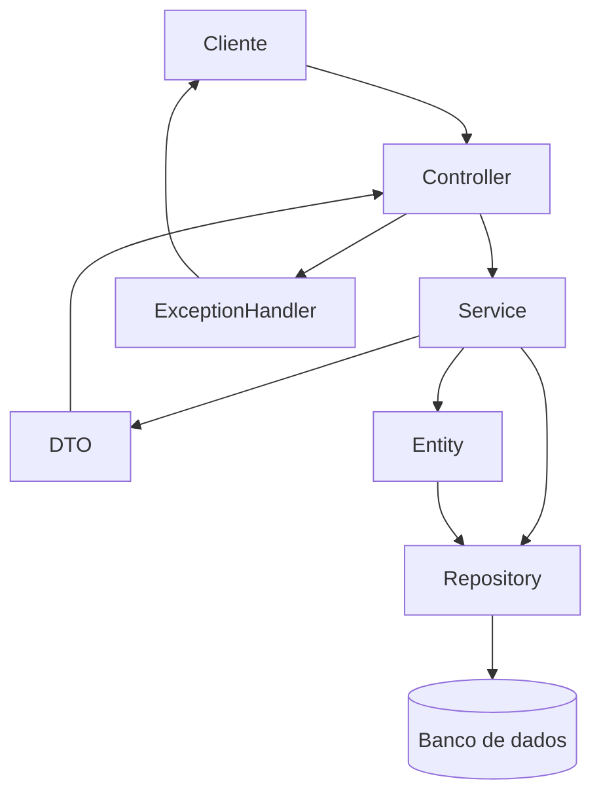
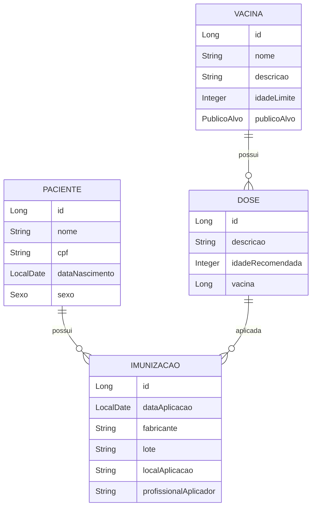
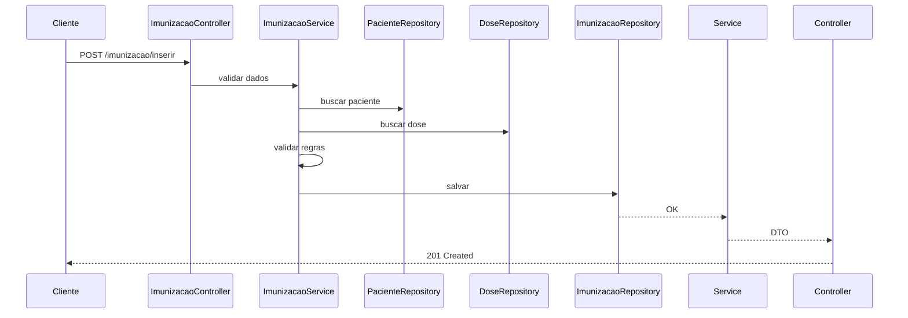

<div align="center">
 


# 💉 API de Calendário de Vacinação

**Sistema completo para gerenciamento do histórico de imunização familiar**  
com controle de doses, validações inteligentes e calendário vacinal automatizado.
 
<br/>
 


 


 
</div>
 
---

# 📖 Sobre o projeto

A **API de Calendário de Vacinação** é um sistema backend desenvolvido em **Java com Spring Boot** que permite o controle completo do histórico de vacinação de pacientes.

O sistema permite:

* Cadastro de pacientes
* Cadastro de vacinas
* Registro de imunizações
* Controle de doses aplicadas
* Consultas por período
* Identificação de vacinas atrasadas
* Estatísticas de vacinação

Projeto desenvolvido como parte do **Hackathon Mesttra**.

---

# 🎯 Objetivo do sistema

Fornecer uma API REST capaz de:

* Centralizar histórico vacinal
* Garantir integridade dos dados médicos
* Aplicar validações de regras de negócio
* Permitir futuras integrações frontend
* Gerar indicadores de vacinação

---

# 🏗️ Arquitetura do sistema

O projeto segue arquitetura em camadas:

Controller → Service → Repository → Entity → DTO → Exception Handler



---

# 🧠 Organização do projeto

Estrutura real do código:

```id="qv2dso"
src/main/java/com/hackaton/grupo1/demo/

config/
controller/
dto/
entity/
repository/
service/
exceptions/
enums/
```

---

# 🗄️ Modelo de dados



---

# 🔄 Fluxo de registro de imunização



---

## 🚀 Tecnologias Utilizadas
 
O projeto utiliza o ecossistema Spring para fornecer uma base robusta e escalável:
 
| Tecnologia | Versão | Descrição |
|---|---|---|
| ☕ **Java** | 17 (LTS) | Linguagem base do projeto |
| 🍃 **Spring Boot** | 4.0.3 | Framework principal |
| 🗄️ **Spring Data JPA** | — | Abstração da camada de persistência |
| 🐬 **MySQL** | — | Banco de dados relacional |
| 📖 **SpringDoc OpenAPI** | — | Documentação interativa (Swagger) |
| 📦 **Maven** | — | Gerenciador de dependências e build |
 
# 📋 Funcionalidades

## 👤 Pacientes

* Cadastrar paciente
* Consultar pacientes
* Consultar por ID
* Atualizar paciente
* Excluir paciente

Validações:

* CPF não pode duplicar
* Data nascimento não pode ser futura

---

## 💉 Vacinas

* Cadastro de vacinas
* Consulta geral
* Consulta por faixa etária
* Consulta por idade mínima

---

## 📋 Imunizações

* Registrar aplicação
* Atualizar registro
* Excluir registro
* Consultar por paciente
* Consultar por período

Validações:

* Data não pode ser futura
* Data não pode ser anterior ao nascimento
* Dose não pode duplicar

---

## 📊 Estatísticas

O sistema possui consultas para:

* Vacinas aplicadas por paciente
* Vacinas atrasadas
* Vacinas previstas
* Indicadores de vacinação

---

# 📡 Endpoints principais

## Paciente

```http
GET /paciente/consultar

GET /paciente/consultar/{id}

POST /paciente/inserir

PUT /paciente/alterar/{id}

DELETE /paciente/excluir/{id}
```

---

## Vacinas

```http
GET /vacinas/consultar

POST /vacinas/cadastrar

GET /vacinas/consultar/faixa_etaria/{faixa}

GET /vacinas/consultar/idade_maior/{meses}
```

---

## Imunização

```http
POST /imunizacao/inserir

PUT /imunizacao/alterar/{id}

DELETE /imunizacao/excluir/{id}

GET /imunizacao/consultar

GET /imunizacao/consultar/{id}

GET /imunizacao/consultar/paciente/{id}
```

---

# 📬 Exemplo request

Cadastro paciente:

```json
{
"nome":"Maria Silva",
"cpf":"12345678900",
"sexo":"F",
"dataNascimento":"2000-05-10"
}
```

---

# 📤 Exemplo response

```json
{
"id":1,
"nome":"Maria Silva",
"cpf":"12345678900"
}
```

---

## 🛠️ Como Executar
 
### Pré-requisitos
 
- [x] **Java 17** instalado
- [x] Servidor **MySQL** rodando localmente
- [x] Variáveis de ambiente configuradas:
 
```bash
JDBC_USERNAME_LOCALHOST=seu_usuario
JDBC_PASSWORD_LOCALHOST=sua_senha
```
 
### Passo a passo
 
**1. Clone o repositório**
```bash
git clone https://github.com/seu-usuario/seu-repositorio.git
cd seu-repositorio
```
 
**2. Crie o banco de dados no MySQL**
```sql
CREATE DATABASE vacinacao;
```
 
**3. Execute a aplicação**
 
```bash
# Linux / macOS
./mvnw spring-boot:run
```
 
```bash
# Windows
.\mvnw.cmd spring-boot:run
```
 
---
 
## 📖 Documentação da API
 
Após iniciar a aplicação, acesse a documentação interativa:
 
> 🔗 **Swagger UI:** [`http://localhost:8080/swagger-ui.html`](http://localhost:8080/swagger-ui.html)
 
---
 
## 🏗️ Estrutura de Pacotes
 
```
src/main/java/com/mesttra/vacinacao/
│
├── 🟢 controller/      # Endpoints REST expostos ao cliente
├── 🔵 dto/             # Objetos de transferência de dados
├── 🟠 entity/          # Entidades JPA — Dose, Imunizacao, Paciente, Vacina
├── 🟣 repository/      # Interfaces JPA para comunicação com o banco
├── 🌿 service/         # Regras de negócio e validações
└── 🔴 exceptions/      # Tratamento de erros e respostas amigáveis
```
 
---
 

---

# 🧪 Regras de negócio implementadas

O sistema impede:

* CPF duplicado
* Dose duplicada
* Datas inválidas
* Paciente inexistente
* Dose inexistente

---

# 🎯 Competências demonstradas

Este projeto demonstra conhecimento em:

Backend Java

Spring Boot

REST APIs

Arquitetura em camadas

DTO Pattern

Validação de dados

Modelagem de banco

Documentação API

Tratamento de exceções

Git


---


# 📄 Licença

Projeto desenvolvido para fins educacionais.

<div align="center">

---
 
Desenvolvido com ❤️ para o **Desafio Mesttra**
 
</div>
